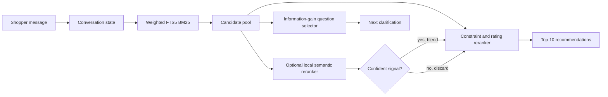

# TechJam Conversational E-Commerce Search

> A multi-turn shopping agent that turns vague requests into precise, ranked product recommendations—without sending customer data to a hosted service.

Built for the **TechJam Conversational E-Commerce Search Challenge**, this project searches a frozen catalog of 50,000 clothing, shoe, and jewelry products. The agent has at most 10 conversational turns to uncover a shopper's intent and place the hidden target product in its Top 10 results.

The system combines fast lexical retrieval, catalog-grounded semantic reranking, structured conversation memory, and information-gain-based follow-up questions. It runs entirely offline with a strong deterministic fallback, or can use local Ollama models for enhanced semantic matching.

## Results at a Glance

Results below are from the 200-session public development set. The Ollama-off run
is the default configuration.

| System                                      | Hit Rate@10 |          MRR |    MTTC ↓ | Efficiency | Technical Score |
| ------------------------------------------- | ----------: | -----------: | --------: | ---------: | --------------: |
| Provided weak BM25 baseline                 |       12.5% |       0.0680 |     9.810 |     0.1190 |          0.1067 |
| **Our conversational agent - LLM Disabled** |   **98.5%** | **0.523732** | **3.455** | **0.7545** |     **0.80052** |
| **Our conversational agent - LLM Enabled**  |   **98.5%** | **0.521768** | **3.455** | **0.7545** |     **0.79993** |

With LLM Disabled, the run used 0 tokens. With LLM Enabled, the run used 125778 tokens across 200 sessions and incurred **$0 in external API cost**.

## Why It Stands Out

- **Useful questions, not scripted questions.** The agent calculates rank-weighted information gain over the current candidate pool and asks about the attribute most likely to narrow the search.
- **Conversation-aware retrieval.** Confirmed constraints, declined preferences, previously shown products, and the latest shopper message are retained as structured session state.
- **Intent override recovery.** When a shopper changes their mind, stale preferences are retired and retrieval is rebuilt around the replacement need.
- **Hybrid search with guardrails.** Weighted SQLite FTS5 BM25 retrieves a bounded candidate set; local embeddings rerank it only when the semantic signal is confident enough.
- **Catalog-grounded semantics.** The local LLM may select only concepts that already occur in candidate products, reducing hallucinated query expansion.
- **Privacy-first and resilient.** No API key or internet connection is required. If Ollama is disabled or unavailable, the agent immediately falls back to deterministic retrieval and grounding.

## Architecture



The response loop is deliberately lightweight:

1. Parse the new message and update category, preference, and hard-constraint state.
2. Retrieve candidates with field-weighted BM25 across titles, categories, features, details, store, and descriptions.
3. Optionally rerank the bounded pool using locally generated concepts and embeddings.
4. Apply grounded constraints and a small review-count-smoothed quality prior.
5. Return up to 10 unseen products and ask the highest-value remaining question.

## Quick Start

### Requirements

- Python 3.10 or newer
- A standard Python build with SQLite FTS5 support
- No third-party Python packages

The submission repository intentionally does not include `data/`, `evaluator/`,
`tests/`, or `docs/`. Those directories contain organizer-provided development
artifacts rather than participant runtime source. During official evaluation,
the organizer must make the frozen 50,000-product catalog available to the
agent and pass its path to `Agent(...)`.

For local development, place the organizer-provided catalog at
`data/catalog.jsonl`. The public sessions and local evaluator are optional
development tools distributed by the organizer; they are not needed by the
agent at runtime and are not part of this repository.

The submission includes `submission/assets/catalog_attributes.jsonl`, a
catalog-derived representation of the frozen catalog. To reproduce or refresh
it from the organizer-provided raw catalog, run:

```bash
python -m submission.src.extract_product_attributes \
  --input data/catalog.jsonl \
  --output submission/assets/catalog_attributes.jsonl
```

With `OLLAMA_ENABLED=0` (the default), this uses the deterministic parser for
catalog-grounded extraction. Set `OLLAMA_ENABLED=1` to opt into the configured
local Ollama model. If Ollama cannot serve a request, it falls back to the
deterministic parser. Both paths produce the same output schema.

This bundled asset enables adaptive questions, answer grounding, constraint and
rating reranking, and catalog-grounded semantic concepts. It contains product
metadata derived from the public frozen catalog—not public-session labels,
private evaluation data, user data, or credentials.

### Run the deterministic offline agent

The official harness imports `Agent` directly. The network-free deterministic
path is the default. To explicitly select it, set `OLLAMA_ENABLED=0` in the
evaluation environment before starting that harness.

PowerShell:

```powershell
$env:OLLAMA_ENABLED = "0"
```

Bash:

```bash
export OLLAMA_ENABLED=0
```

If you have the organizer's development package locally, the reproducible
public-harness command is:

```bash
python -m evaluator.local_evaluator \
  --catalog data/catalog.jsonl \
  --dataset data/public_set.jsonl \
  --output results.json
```

The evaluator, raw catalog, and public labels are supplied separately by the
organizer and are deliberately not duplicated here.

### Catalog attributes and embeddings

`catalog_attributes.jsonl` is the shared structured representation that connects the retrieval and conversation systems:

```text
catalog.jsonl
    ↓ deterministic extraction
catalog_attributes.jsonl
    ↓ concepts_for_item()
canonical product concepts
    ↓ local Ollama embedding model
semantic_index.sqlite
```

The embedding builder does not embed each attribute row as one document. It converts every product into at most 16 canonical concepts, such as:

```text
category: shoes
material: leather
color: black
feature: waterproof
use_case: hiking/outdoor
```

Each unique concept is embedded once and then associated with every matching product. The same structured attributes also power information-gain question selection, clarification-answer grounding, constraint reranking, and the rating prior. The entropy-based question selector itself is deterministic and does not require an LLM or embeddings.

It is technically possible to build embeddings from `catalog.jsonl` directly, but the current concept index intentionally uses normalized attributes. Passing raw rows directly to `concepts_for_item()` would capture categories while missing much of the information nested in `details` or expressed in titles, features, and descriptions. Direct raw-catalog support would therefore need either:

- deterministic attribute extraction inside the index builder, which removes the intermediate file but performs the same logical preprocessing; or
- a different full-text/chunk embedding design, which would require new indexing and runtime scoring logic and would create a larger, noisier index.

Keeping `catalog_attributes.jsonl` is deliberate: even if semantic embeddings came from raw product text, the conversational decision tree would still need normalized attributes to choose useful questions.

### Enable local semantic reranking

Install Ollama from [ollama.com/download](https://ollama.com/download), or on
Linux with `curl -fsSL https://ollama.com/install.sh | sh`, and ensure the
service is running (`ollama serve`; the desktop app starts it automatically).
Then pull the two local models:

```bash
ollama pull llama3.2:3b
ollama pull nomic-embed-text-v2-moe
```

The optional semantic path talks to Ollama on `http://localhost:11434`. Start
the organizer's harness with `OLLAMA_ENABLED=1` to opt in.

For faster repeated runs, build the persistent concept-vector index once:

```bash
python -m submission.src.precompute
```

This creates `submission/assets/semantic_index.sqlite` by default. The agent
also creates a catalog-fingerprinted `submission/assets/catalog_fts.sqlite` cache on first
use. Both caches are generated artifacts and are automatically bypassed when
incompatible with their source data or model.

The precompute command reports the total embedding tokens used across its
Ollama batches when the server provides `prompt_eval_count` usage metadata.

## Agent Contract

The agent entry point is `submission/agent.py`. Because it is packaged under
`submission/`, the evaluation harness imports it as `submission.agent`, not as
the starter kit's top-level `agent` module:

```python
from submission.agent import Agent

agent = Agent("data/catalog.jsonl")          # organizer-provided catalog path
agent.reset(session_id, user_profile)
response = agent.respond(session_id, user_message, turn, top_k=10)
```

Harnesses that place `submission/` on `sys.path` may use `from agent import Agent`
instead; both import forms are supported.

Each response follows the competition contract:

```python
{
    "message": "I found some close matches. Any preference on material?",
    "ask_attribute": "material",
    "recommendations": [{"parent_asin": "B000..."}],
    "usage": {"prompt_tokens": 0, "completion_tokens": 0},
}
```

Only exact `parent_asin` matches count. Recommendations are ordered best to worst, and only the first 10 valid unique IDs are scored.

## Scoring

The challenge rewards finding the correct product, ranking it highly, and finding it early:

```text
Efficiency = clip((11 - MTTC) / 10, 0, 1)
Technical Score = 0.50 × Hit Rate@10 + 0.30 × MRR + 0.20 × Efficiency
```

- **Hit Rate@10:** fraction of sessions where the target appears in the Top 10.
- **MRR:** average reciprocal rank of the target; misses contribute zero.
- **MTTC:** mean first-hit turn; misses are assigned turn 11.

## Configuration

All settings are optional environment variables; the defaults reproduce the
checked-in configuration.

<!-- Keep this table in sync with SUBMISSION.md § Environment variables. -->

| Variable                     | Default                                      | Purpose                                                                                                                            |
| ---------------------------- | -------------------------------------------- | ---------------------------------------------------------------------------------------------------------------------------------- |
| `OLLAMA_ENABLED`             | `0`                                          | Set to `1` to opt into local Ollama; `0`, `false`, `no`, or unset selects the deterministic offline path.                          |
| `OLLAMA_URL`                 | `http://localhost:11434`                     | Local Ollama base URL.                                                                                                             |
| `OLLAMA_MODEL`               | `llama3.2:3b`                                | Catalog-constrained concept-selection model.                                                                                       |
| `OLLAMA_EMBED_MODEL`         | `nomic-embed-text-v2-moe`                    | Local embedding model and semantic-index identity.                                                                                 |
| `OLLAMA_TIMEOUT`             | `30`                                         | Per-request timeout in seconds for the agent. The `extract_product_attributes` build script uses `120` when the variable is unset. |
| `SEMANTIC_CANDIDATES`        | `50`                                         | Normal BM25 candidate-pool size.                                                                                                   |
| `OVERRIDE_CANDIDATES`        | `150`                                        | Candidate-pool size after an intent override.                                                                                      |
| `SEMANTIC_CONFIDENCE_MARGIN` | `0.015`                                      | Minimum top-vs-runner-up semantic-score separation before a rerank is trusted.                                                     |
| `SEMANTIC_BLEND_WEIGHT`      | `0.85`                                       | Semantic contribution to a confident rerank.                                                                                       |
| `SEMANTIC_EXPANSION_WEIGHT`  | `0.20`                                       | Contribution from model-selected concept expansions; `0` disables the LLM expansion call.                                          |
| `BM25_WEIGHTS`               | `0,4.5,4,2.5,2.5,1.5,1`                      | Seven non-negative FTS5 column weights: `parent_asin` (unindexed), title, categories, features, details, store, description.       |
| `CATALOG_FTS_PATH`           | `submission/assets/catalog_fts.sqlite`       | Optional generated FTS cache path.                                                                                                 |
| `CATALOG_ATTRIBUTES_PATH`    | `submission/assets/catalog_attributes.jsonl` | Structured attributes used for questions, constraints, and ratings.                                                                |
| `CLEAN_CATALOG_PATH`         | `submission/assets/catalog_attributes.jsonl` | Concept source for semantic retrieval (the same bundled file by default).                                                          |
| `SEMANTIC_INDEX_PATH`        | `submission/assets/semantic_index.sqlite`    | Optional persisted concept-vector index (resolved beside `CLEAN_CATALOG_PATH`).                                                    |

## Repository Layout

The official upload unit is the self-contained `submission/` directory. Files
at the repository root document or exercise the project but are not required by
the evaluation runtime.

```text
README.md                     project overview and setup instructions
SUBMISSION.md                 method, reproducibility, cost, and limitations report
DATA_ATTRIBUTION.md           source-data attribution
ENTROPY_QUESTION_SELECTION.md question-selection design notes
submission/
  __init__.py
  agent.py                    required Agent entry point
  demo.py                     offline multi-turn demonstration script
  README.md                   submission setup and harness instructions
  requirements.txt            Python dependency manifest (standard library only)
  assets/
    catalog_attributes.jsonl  bundled catalog-derived runtime attributes
  src/
    __init__.py
    extract_product_attributes.py Ollama-or-deterministic attribute extractor
    question_selection.py     entropy and answer-grounding logic
    semantic_index.py         concept and index utilities
    precompute.py             optional semantic-index preprocessing
```

Not included in the submission repository:

- `data/`: organizer raw catalog/public sessions and locally generated indexes
- `evaluator/`: organizer development harness
- `tests/`: organizer/development tests
- `docs/`: organizer rules, API contract, and competition specification

This matches the published submission rules: teams submit their agent source,
helper modules, setup instructions, and report, while organizer-owned files and
evaluation data are not copied into the participant bundle.

## Limitations

- The public evaluation set is visible development data, so its score should not be treated as an estimate of private-set performance.
- The deterministic fallback cannot capture semantic synonyms as well as the local embedding path.
- Intent and attribute parsing is primarily English and pattern-assisted.
- First startup is slower when the generated FTS cache is absent; semantic mode is also hardware-dependent.
- Question quality depends on the completeness of catalog metadata. Missing fields are treated as unknown rather than negative evidence.

## Data and Responsible Use

The catalog and sessions are derived from **Amazon Reviews 2023** by McAuley Lab, UCSD. The agent receives only an anonymized aggregate preference profile—no raw user identifiers, review text, timestamps, or purchase history. See [`DATA_ATTRIBUTION.md`](DATA_ATTRIBUTION.md) for source and redistribution details. The complete challenge protocol and API contract are supplied separately by the organizer and are intentionally not copied into this repository.

---

Built for fast, private, and genuinely conversational product discovery.
